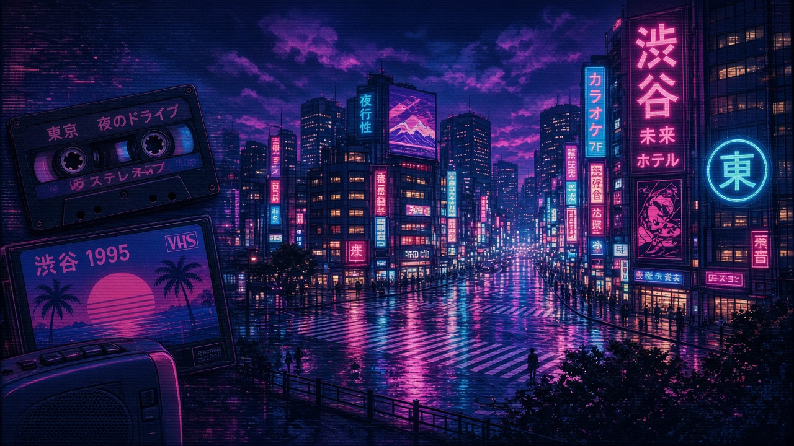
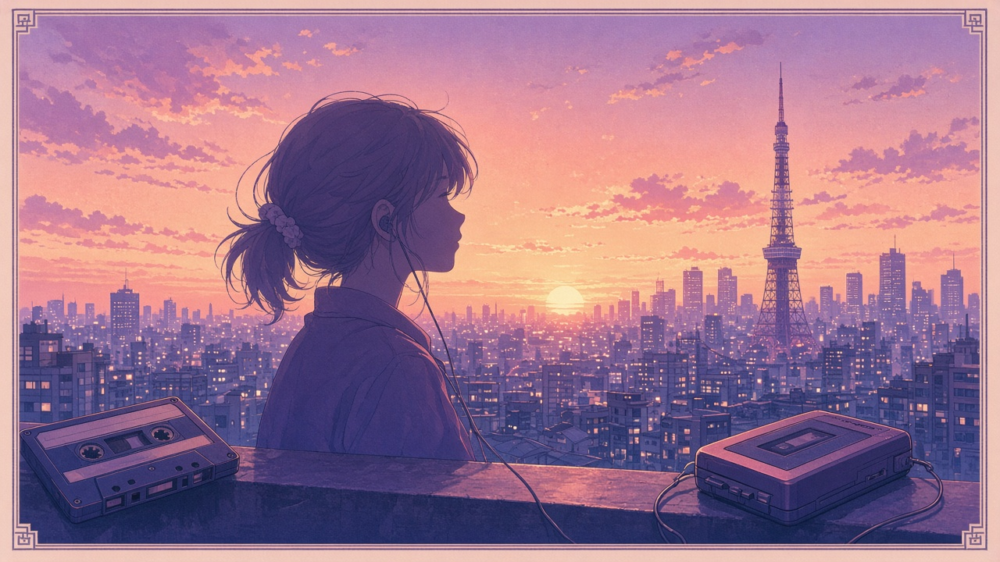
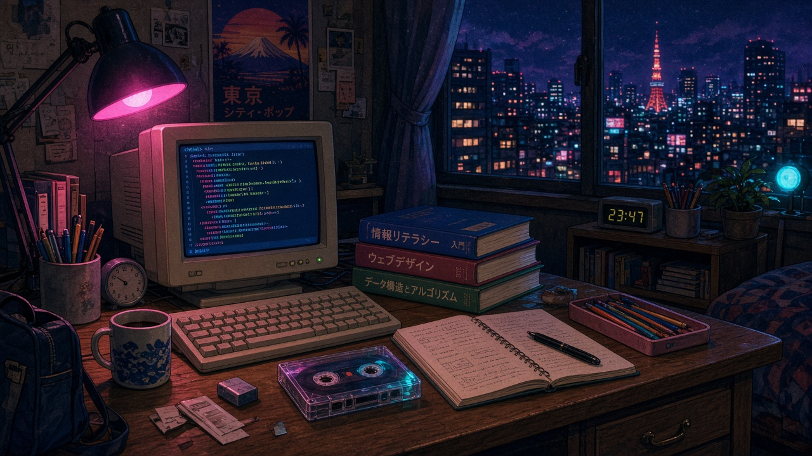
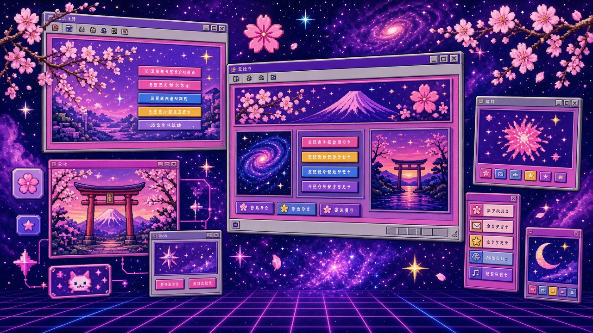
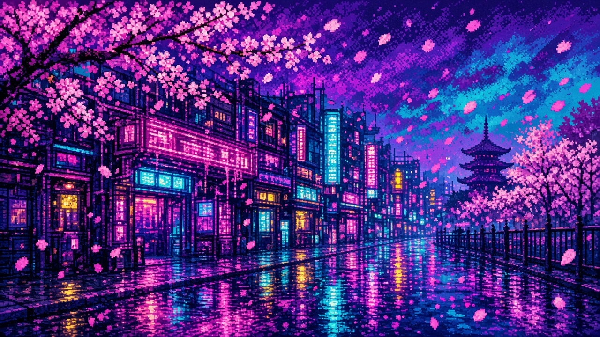

  

 

# Привет! Я Артём Скопенков 👋

### Студент · группа **ИС2-241-ОБ** · Web-дизайн & разработка

---

## 🧑‍💻 Обо мне

Привет! Меня зовут **Артём Скопенков**. Я студент группы **ИС2-241-ОБ** и изучаю веб-дизайн и разработку.

Здесь — моё портфолио в духе ретро-эстетики 90-х: учебные работы, сайты и приложения.

- 🎓 Информационные системы
- 🎨 Web-дизайн, вёрстка, аккуратный UI
- 🚀 Сайты и небольшие приложения
- 📚 Учусь на практике — от лабораторных до своих идей
- 📼 Вайб **Японии 90-х**: неон, city pop, VHS-ностальгия

---

## 🛠️ Навыки

---

## 📁 Проекты

### 📘 Учебные проекты

  

 

| Проект | Описание | Стек |
|:-------|:---------|:-----|
| [Легенды русской поэзии](https://github.com/FURFanTom1331FUR) | Лабораторная работа №1 (Web-дизайн): одностраничник с шапкой, якорями и секциями поэтов | HTML, CSS |

> Скоро здесь появятся новые лабораторные и курсовые работы.

### 🌐 Сайты

  

 

| Проект | Описание | Статус |
|:-------|:---------|:-------|
| — | Лендинги и учебные одностраничники | В работе |

### 📱 Приложения

  

 

| Проект | Описание | Статус |
|:-------|:---------|:-------|
| — | Небольшие приложения и утилиты | Планируется |

---

## 📊 GitHub-статистика

  
  

---

## ✉️ Связь

Хочешь обсудить проект или учёбу — пиши через GitHub:

👉 [github.com/FURFanTom1331FUR](https://github.com/FURFanTom1331FUR)

⭐️ Спасибо, что заглянул(а)!

